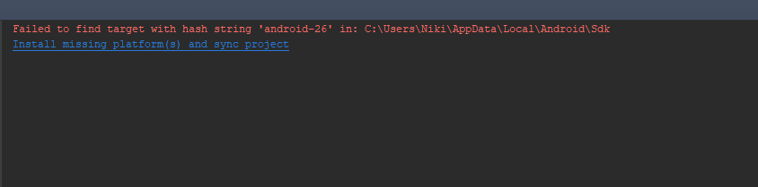
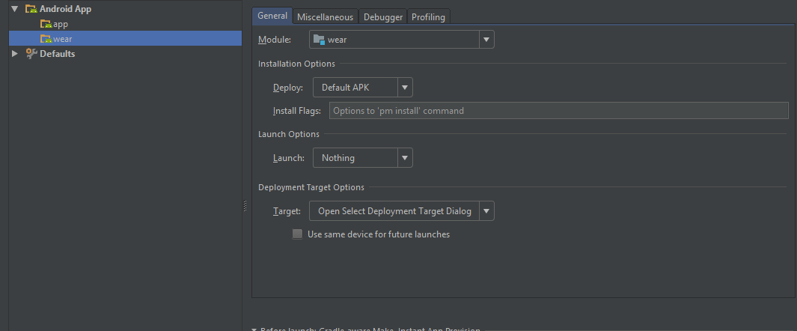

## First Start
1. Check Out the wearableSupport Branch
2. Install android-26 and android-17 and sync Project if asked  
  
3. Activate Developer Options on the Smart Watch  
- Swipe down from the top of the screen  
- Tap the Settings icon (gear icon)  
- Scroll down and tap the System option  
- Scroll down and tap the About option  
- Then scroll down and tap the Build Number option about 7-10 times  
- Keep tapping until it says you're now a developer  
- Swipe to the right twice  
- Scroll down and you'll see the Developer Options option at the bottom  
- Open the Developer Option and activate "ADB Debugging" and "Debugging over Bluetooth"  
4. Start the "wear" Module of the App. If you get a "Default Activity not Found" Error, open "Edit Configurations" and set Launch Activity to "Nothing"  
  
5. Start the Module Wear and Allow Debugging in the Dialog on the Watch  

6. Start the Stila Phone App (module "app") from Android Studio  

7. Pick "Android Wear" as Tracking Method on the Phone and follow the instructions on the Phone to activate the Stila Watch Face on the Watch  

8. The Watch should now track your heart rate (be sure to confirm the Permission). To edit the Settings press & hold on the watch face

If you have any problems starting the app, it's most likely due to missing dependencies in your SDK. You can Install those using

## Development

These commands have to be input in the "Terminal" Tab of Android Studio. You have to have adb.exe in your PATH, if you run Windows.

**Find the name of the smartwatch**

``adb devices``

**Uninstall Watch App**

``adb -s YOURDEVICENAME uninstall lmu.pms.stila``

**Open Shell on Phone or Watch**

``adb -s YOURDEVICENAME shell``

**Bluetooth Debugging**

(Phone has to be connected to PC and Bluetooth Debugging has to be activated in the WearOS App on the Phone)

``adb forward tcp:4444 localabstract:/adb-hub``

``adb connect 127.0.0.1:4444``
